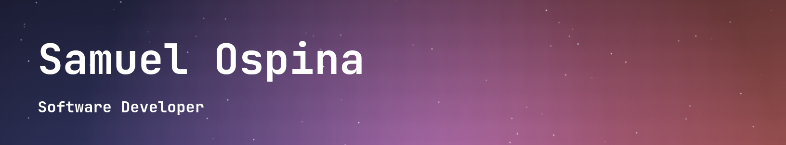

# Portafolio Ospina115



---

## 🚧 Tecnologias

Este proyecto se elaboró mediante Node Package Manager (NPM) en la version 10.9.2 para gestionar los paquetes de JavaScript, implementa la biblioteca de React en la version 18.3.1 para la construccion de interfaces de usuario, Vite 5.4.8 como herramienta para el desarrollo del proyecto web, utiliza la libreria de JavaScript Lenis 1.3.1 para efectos visuales, igualmente que MagicUI

  

---


## 🚀 Instalacion

Para poder iniciar el proyecto de manera local es necesario primeramente tener todos los archivos necesarios del repositorio en tu maquina, seguido a esto necesitas abrir la consola y dirigirse a la ruta de la carpeta en donde tengas el repositorio descargado.
Seguido, debes instalar las dependencias con el siguiente comando:
```bash
npm install
```
una vez descargadas e instaladas las dependencias puedes iniciar el proyecto localmente usando un puerto, para esto debes ejecutar:
```bash
npm run dev
```

---
## 🖥 Extras

El editor de codigo implementado fue:


El despliegue y el hosting gracias a: 

Diseño y prototipado del WebSite: 

Control de versiones implementado: 

---

## 📈 Estatus de la Pagina:

[](https://app.netlify.com/sites/portafoliosamuel115/deploys)


<!-- REPO DE DONDE SAQUÉ LOS ICONOS -->
<!-- https://github.com/Ileriayo/markdown-badges -->
